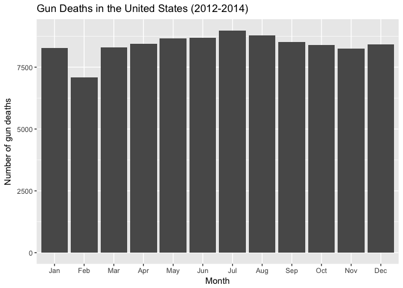
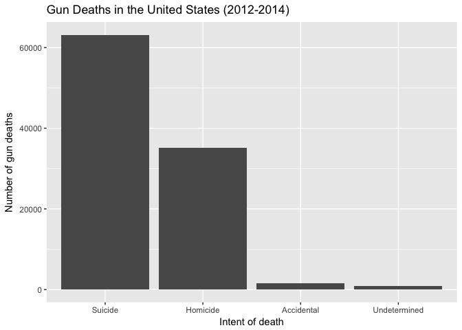
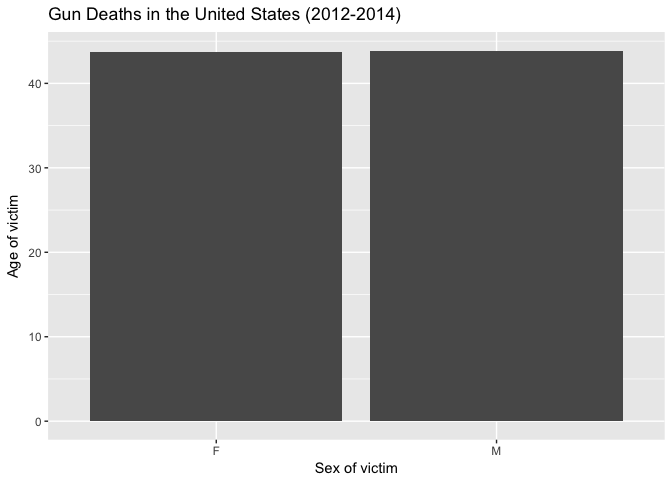
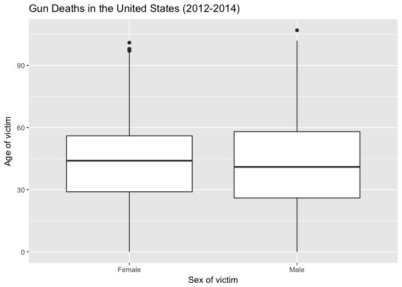
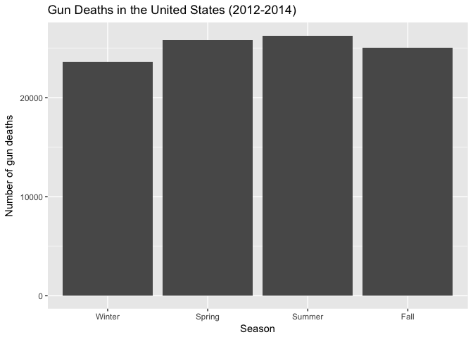
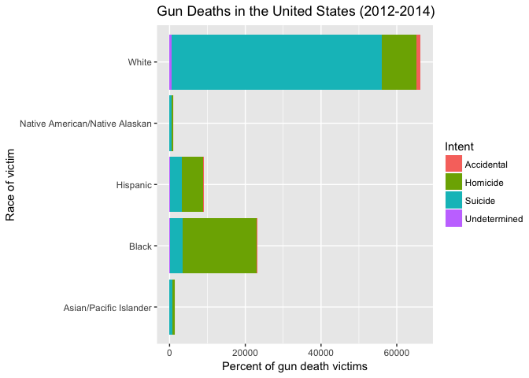
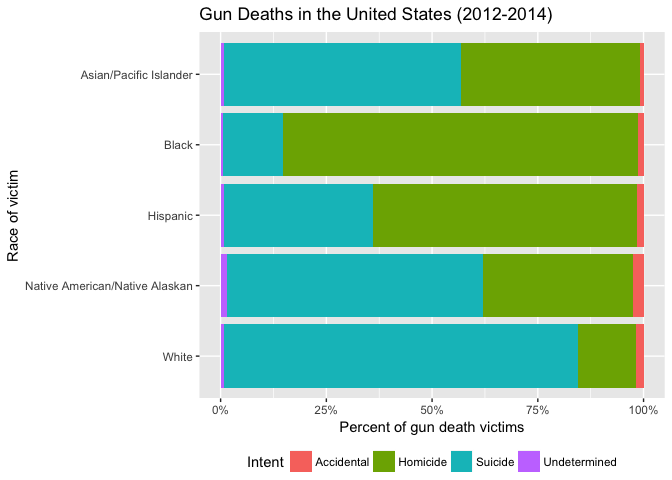

Exploring Gun Deaths in America
================
Benjamin Soltoff
October 10, 2016

Get the data
------------

``` r
library(tidyverse)    # load tidyverse packages, including ggplot2

# get data from rcfss package
# install latest version if not already installed
devtools::install_github("uc-cfss/rcfss")
library(rcfss)

# load the data
data("gun_deaths")
gun_deaths
```

    ## # A tibble: 100,798 × 10
    ##       id  year month       intent police   sex   age
    ##    <int> <int> <dbl>        <chr>  <int> <chr> <int>
    ## 1      1  2012     1      Suicide      0     M    34
    ## 2      2  2012     1      Suicide      0     F    21
    ## 3      3  2012     1      Suicide      0     M    60
    ## 4      4  2012     2      Suicide      0     M    64
    ## 5      5  2012     2      Suicide      0     M    31
    ## 6      6  2012     2      Suicide      0     M    17
    ## 7      7  2012     2 Undetermined      0     M    48
    ## 8      8  2012     3      Suicide      0     M    41
    ## 9      9  2012     2   Accidental      0     M    50
    ## 10    10  2012     2      Suicide      0     M    NA
    ## # ... with 100,788 more rows, and 3 more variables: race <chr>,
    ## #   place <chr>, education <fctr>

In what month do the most gun deaths occur?
-------------------------------------------

    ## # A tibble: 12 × 2
    ##    month     n
    ##    <dbl> <int>
    ## 1      1  8273
    ## 2      2  7093
    ## 3      3  8289
    ## 4      4  8455
    ## 5      5  8669
    ## 6      6  8677
    ## 7      7  8989
    ## 8      8  8783
    ## 9      9  8508
    ## 10    10  8406
    ## 11    11  8243
    ## 12    12  8413



What is the most common intent in gun deaths? Do most people killed by guns die in suicides, homicides, or accidental shootings?
--------------------------------------------------------------------------------------------------------------------------------

    ## # A tibble: 5 × 2
    ##         intent     n
    ##          <chr> <int>
    ## 1   Accidental  1639
    ## 2     Homicide 35176
    ## 3      Suicide 63175
    ## 4 Undetermined   807
    ## 5         <NA>     1



What is the average age of females killed by guns?
--------------------------------------------------

    ## # A tibble: 2 × 2
    ##     sex     mean
    ##   <chr>    <dbl>
    ## 1     F 43.69507
    ## 2     M 43.88480

### Using a bar graph



### Using a boxplot



How many white males with at least a high school education were killed by guns in 2012?
---------------------------------------------------------------------------------------

    ## # A tibble: 1 × 1
    ##       n
    ##   <int>
    ## 1 15199

Which season of the year has the most gun deaths?
-------------------------------------------------

Assume that:

-   Winter = January-March
-   Spring = April-June
-   Summer = July-September
-   Fall = October-December

<!-- -->

    ## # A tibble: 4 × 2
    ##   season     n
    ##   <fctr> <int>
    ## 1 Winter 23655
    ## 2 Spring 25801
    ## 3 Summer 26280
    ## 4   Fall 25062



What is the relationship between race and intent?
=================================================

For example, are whites who are killed by guns more likely to die because of suicide or homicide? How does this compare to blacks and hispanics?

    ## Source: local data frame [21 x 3]
    ## Groups: race [?]
    ## 
    ##                      race       intent     n
    ##                     <chr>        <chr> <int>
    ## 1  Asian/Pacific Islander   Accidental    12
    ## 2  Asian/Pacific Islander     Homicide   559
    ## 3  Asian/Pacific Islander      Suicide   745
    ## 4  Asian/Pacific Islander Undetermined    10
    ## 5                   Black   Accidental   328
    ## 6                   Black     Homicide 19510
    ## 7                   Black      Suicide  3332
    ## 8                   Black Undetermined   126
    ## 9                Hispanic   Accidental   145
    ## 10               Hispanic     Homicide  5634
    ## # ... with 11 more rows

An okay graph
-------------



A better graph
--------------



Session info
------------

``` r
devtools::session_info()
```

    ##  setting  value                       
    ##  version  R version 3.3.1 (2016-06-21)
    ##  system   x86_64, darwin13.4.0        
    ##  ui       X11                         
    ##  language (EN)                        
    ##  collate  en_US.UTF-8                 
    ##  tz       America/Chicago             
    ##  date     2016-10-06                  
    ## 
    ##  package    * version    date       source                            
    ##  assertthat   0.1        2013-12-06 CRAN (R 3.3.0)                    
    ##  colorspace   1.2-6      2015-03-11 CRAN (R 3.3.0)                    
    ##  curl         2.1        2016-09-22 cran (@2.1)                       
    ##  DBI          0.5-1      2016-09-10 CRAN (R 3.3.0)                    
    ##  devtools     1.12.0     2016-06-24 CRAN (R 3.3.0)                    
    ##  digest       0.6.10     2016-08-02 CRAN (R 3.3.0)                    
    ##  dplyr      * 0.5.0      2016-06-24 CRAN (R 3.3.0)                    
    ##  evaluate     0.9        2016-04-29 CRAN (R 3.3.0)                    
    ##  formatR      1.4        2016-05-09 CRAN (R 3.3.0)                    
    ##  ggplot2    * 2.1.0.9001 2016-10-01 Github (hadley/ggplot2@feb3ffd)   
    ##  git2r        0.15.0     2016-05-11 CRAN (R 3.3.0)                    
    ##  gtable       0.2.0      2016-02-26 CRAN (R 3.3.0)                    
    ##  htmltools    0.3.5      2016-03-21 CRAN (R 3.3.0)                    
    ##  httr         1.2.1      2016-07-03 CRAN (R 3.3.0)                    
    ##  knitr        1.14       2016-08-13 CRAN (R 3.3.0)                    
    ##  labeling     0.3        2014-08-23 CRAN (R 3.3.0)                    
    ##  lazyeval     0.2.0      2016-06-12 CRAN (R 3.3.0)                    
    ##  magrittr     1.5        2014-11-22 CRAN (R 3.3.0)                    
    ##  memoise      1.0.0      2016-01-29 CRAN (R 3.3.0)                    
    ##  munsell      0.4.3      2016-02-13 CRAN (R 3.3.0)                    
    ##  plyr         1.8.4      2016-06-08 CRAN (R 3.3.0)                    
    ##  purrr      * 0.2.2      2016-06-18 CRAN (R 3.3.0)                    
    ##  R6           2.1.3      2016-08-19 CRAN (R 3.3.0)                    
    ##  rcfss      * 0.1.0      2016-10-06 Github (uc-cfss/rcfss@63523fe)    
    ##  Rcpp         0.12.7     2016-09-05 cran (@0.12.7)                    
    ##  readr      * 1.0.0      2016-08-03 CRAN (R 3.3.0)                    
    ##  rmarkdown    1.0.9016   2016-10-02 Github (rstudio/rmarkdown@fe693c3)
    ##  scales       0.4.0      2016-02-26 CRAN (R 3.3.0)                    
    ##  stringi      1.1.1      2016-05-27 CRAN (R 3.3.0)                    
    ##  stringr      1.1.0      2016-08-19 cran (@1.1.0)                     
    ##  tibble     * 1.2        2016-08-26 cran (@1.2)                       
    ##  tidyr      * 0.6.0      2016-08-12 CRAN (R 3.3.0)                    
    ##  tidyverse  * 1.0.0      2016-09-09 CRAN (R 3.3.0)                    
    ##  withr        1.0.2      2016-06-20 CRAN (R 3.3.0)                    
    ##  yaml         2.1.13     2014-06-12 CRAN (R 3.3.0)
