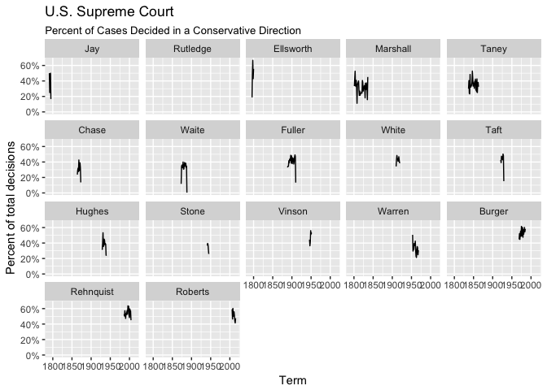

Exploring U.S. Supreme Court Decisions
================
Benjamin Soltoff
October 10, 2016

Get the data
------------

``` r
# load useful packages
library(tidyverse)

# load data
scdbv_mod <- read_csv("data/SCDB_2016_01_justiceCentered_Citation.csv")
scdbv_leg <- read_csv("data/SCDB_Legacy_03_justiceCentered_Citation.csv")
scdbv_mod
```

    ## # A tibble: 78,233 × 61
    ##      caseId    docketId   caseIssuesId               voteId dateDecision
    ##       <chr>       <chr>          <chr>                <chr>        <chr>
    ## 1  1946-001 1946-001-01 1946-001-01-01 1946-001-01-01-01-01   11/18/1946
    ## 2  1946-001 1946-001-01 1946-001-01-01 1946-001-01-01-01-02   11/18/1946
    ## 3  1946-001 1946-001-01 1946-001-01-01 1946-001-01-01-01-03   11/18/1946
    ## 4  1946-001 1946-001-01 1946-001-01-01 1946-001-01-01-01-04   11/18/1946
    ## 5  1946-001 1946-001-01 1946-001-01-01 1946-001-01-01-01-05   11/18/1946
    ## 6  1946-001 1946-001-01 1946-001-01-01 1946-001-01-01-01-06   11/18/1946
    ## 7  1946-001 1946-001-01 1946-001-01-01 1946-001-01-01-01-07   11/18/1946
    ## 8  1946-001 1946-001-01 1946-001-01-01 1946-001-01-01-01-08   11/18/1946
    ## 9  1946-001 1946-001-01 1946-001-01-01 1946-001-01-01-01-09   11/18/1946
    ## 10 1946-002 1946-002-01 1946-002-01-01 1946-002-01-01-01-01   11/18/1946
    ## # ... with 78,223 more rows, and 56 more variables: decisionType <int>,
    ## #   usCite <chr>, sctCite <chr>, ledCite <chr>, lexisCite <chr>,
    ## #   term <int>, naturalCourt <int>, chief <chr>, docket <int>,
    ## #   caseName <chr>, dateArgument <chr>, dateRearg <chr>, petitioner <int>,
    ## #   petitionerState <int>, respondent <int>, respondentState <int>,
    ## #   jurisdiction <int>, adminAction <int>, adminActionState <int>,
    ## #   threeJudgeFdc <int>, caseOrigin <int>, caseOriginState <int>,
    ## #   caseSource <int>, caseSourceState <int>, lcDisagreement <int>,
    ## #   certReason <int>, lcDisposition <int>, lcDispositionDirection <int>,
    ## #   declarationUncon <int>, caseDisposition <int>,
    ## #   caseDispositionUnusual <int>, partyWinning <int>,
    ## #   precedentAlteration <int>, voteUnclear <int>, issue <int>,
    ## #   issueArea <int>, decisionDirection <int>,
    ## #   decisionDirectionDissent <int>, authorityDecision1 <int>,
    ## #   authorityDecision2 <int>, lawType <int>, lawSupp <int>,
    ## #   lawMinor <chr>, majOpinWriter <int>, majOpinAssigner <int>,
    ## #   splitVote <int>, majVotes <int>, minVotes <int>, justice <int>,
    ## #   justiceName <chr>, vote <int>, opinion <int>, direction <int>,
    ## #   majority <int>, firstAgreement <int>, secondAgreement <int>

``` r
scdbv_leg
```

    ## # A tibble: 172,215 × 61
    ##      caseId    docketId   caseIssuesId               voteId dateDecision
    ##       <chr>       <chr>          <chr>                <chr>        <chr>
    ## 1  1791-001 1791-001-01 1791-001-01-01 1791-001-01-01-01-01     8/3/1791
    ## 2  1791-001 1791-001-01 1791-001-01-01 1791-001-01-01-01-02     8/3/1791
    ## 3  1791-001 1791-001-01 1791-001-01-01 1791-001-01-01-01-03     8/3/1791
    ## 4  1791-001 1791-001-01 1791-001-01-01 1791-001-01-01-01-04     8/3/1791
    ## 5  1791-001 1791-001-01 1791-001-01-01 1791-001-01-01-01-05     8/3/1791
    ## 6  1791-002 1791-002-01 1791-002-01-01 1791-002-01-01-01-01     8/3/1791
    ## 7  1791-002 1791-002-01 1791-002-01-01 1791-002-01-01-01-02     8/3/1791
    ## 8  1791-002 1791-002-01 1791-002-01-01 1791-002-01-01-01-03     8/3/1791
    ## 9  1791-002 1791-002-01 1791-002-01-01 1791-002-01-01-01-04     8/3/1791
    ## 10 1791-002 1791-002-01 1791-002-01-01 1791-002-01-01-01-05     8/3/1791
    ## # ... with 172,205 more rows, and 56 more variables: decisionType <int>,
    ## #   usCite <chr>, sctCite <chr>, ledCite <chr>, lexisCite <chr>,
    ## #   term <int>, naturalCourt <int>, chief <chr>, docket <chr>,
    ## #   caseName <chr>, dateArgument <chr>, dateRearg <chr>, petitioner <int>,
    ## #   petitionerState <int>, respondent <int>, respondentState <int>,
    ## #   jurisdiction <int>, adminAction <chr>, adminActionState <chr>,
    ## #   threeJudgeFdc <int>, caseOrigin <int>, caseOriginState <int>,
    ## #   caseSource <int>, caseSourceState <int>, lcDisagreement <int>,
    ## #   certReason <int>, lcDisposition <int>, lcDispositionDirection <int>,
    ## #   declarationUncon <int>, caseDisposition <int>,
    ## #   caseDispositionUnusual <int>, partyWinning <int>,
    ## #   precedentAlteration <int>, voteUnclear <int>, issue <int>,
    ## #   issueArea <int>, decisionDirection <int>,
    ## #   decisionDirectionDissent <int>, authorityDecision1 <int>,
    ## #   authorityDecision2 <int>, lawType <int>, lawSupp <int>,
    ## #   lawMinor <chr>, majOpinWriter <int>, majOpinAssigner <int>,
    ## #   splitVote <int>, majVotes <int>, minVotes <int>, justice <int>,
    ## #   justiceName <chr>, vote <int>, opinion <int>, direction <int>,
    ## #   majority <int>, firstAgreement <int>, secondAgreement <int>

Combine the datasets
--------------------

``` r
scdbv
```

    ## # A tibble: 250,448 × 61
    ##      caseId    docketId   caseIssuesId               voteId dateDecision
    ##       <chr>       <chr>          <chr>                <chr>        <chr>
    ## 1  1946-001 1946-001-01 1946-001-01-01 1946-001-01-01-01-01   11/18/1946
    ## 2  1946-001 1946-001-01 1946-001-01-01 1946-001-01-01-01-02   11/18/1946
    ## 3  1946-001 1946-001-01 1946-001-01-01 1946-001-01-01-01-03   11/18/1946
    ## 4  1946-001 1946-001-01 1946-001-01-01 1946-001-01-01-01-04   11/18/1946
    ## 5  1946-001 1946-001-01 1946-001-01-01 1946-001-01-01-01-05   11/18/1946
    ## 6  1946-001 1946-001-01 1946-001-01-01 1946-001-01-01-01-06   11/18/1946
    ## 7  1946-001 1946-001-01 1946-001-01-01 1946-001-01-01-01-07   11/18/1946
    ## 8  1946-001 1946-001-01 1946-001-01-01 1946-001-01-01-01-08   11/18/1946
    ## 9  1946-001 1946-001-01 1946-001-01-01 1946-001-01-01-01-09   11/18/1946
    ## 10 1946-002 1946-002-01 1946-002-01-01 1946-002-01-01-01-01   11/18/1946
    ## # ... with 250,438 more rows, and 56 more variables: decisionType <int>,
    ## #   usCite <chr>, sctCite <chr>, ledCite <chr>, lexisCite <chr>,
    ## #   term <int>, naturalCourt <int>, chief <chr>, docket <chr>,
    ## #   caseName <chr>, dateArgument <chr>, dateRearg <chr>, petitioner <int>,
    ## #   petitionerState <int>, respondent <int>, respondentState <int>,
    ## #   jurisdiction <int>, adminAction <dbl>, adminActionState <dbl>,
    ## #   threeJudgeFdc <int>, caseOrigin <int>, caseOriginState <int>,
    ## #   caseSource <int>, caseSourceState <int>, lcDisagreement <int>,
    ## #   certReason <int>, lcDisposition <int>, lcDispositionDirection <int>,
    ## #   declarationUncon <int>, caseDisposition <int>,
    ## #   caseDispositionUnusual <int>, partyWinning <int>,
    ## #   precedentAlteration <int>, voteUnclear <int>, issue <int>,
    ## #   issueArea <int>, decisionDirection <int>,
    ## #   decisionDirectionDissent <int>, authorityDecision1 <int>,
    ## #   authorityDecision2 <int>, lawType <int>, lawSupp <int>,
    ## #   lawMinor <chr>, majOpinWriter <int>, majOpinAssigner <int>,
    ## #   splitVote <int>, majVotes <int>, minVotes <int>, justice <int>,
    ## #   justiceName <chr>, vote <int>, opinion <int>, direction <int>,
    ## #   majority <int>, firstAgreement <int>, secondAgreement <int>

Recode variables as you find necessary
--------------------------------------

What percentage of cases in each term are decided by a one-vote margin (i.e. 5-4, 4-3, etc.)
--------------------------------------------------------------------------------------------


In each term he served on the Court, in what percentage of cases was Justice Antonin Scalia in the majority?
------------------------------------------------------------------------------------------------------------


### Advanced challenge: Create a graph similar to above that compares the percentage for all cases versus non-unanimous cases (i.e. there was at least one dissenting vote)


In each term, what percentage of cases were decided in the conservative direction?
----------------------------------------------------------------------------------


### Advanced challenge: The Chief Justice is frequently seen as capable of influencing the ideological direction of the Court. Create a graph similar to the one above that also incorporates information on who was the Chief Justice during the term.

#### Solution using facets (not too much more difficult)



#### Solution using facets and showing whole data on each facet (getting harder)


#### Solution shading original graph with color-coded eras of Chief Justices (attempt at your own risk)


Session info
------------

``` r
devtools::session_info()
```

    ##  setting  value                       
    ##  version  R version 3.3.1 (2016-06-21)
    ##  system   x86_64, darwin13.4.0        
    ##  ui       X11                         
    ##  language (EN)                        
    ##  collate  en_US.UTF-8                 
    ##  tz       America/Chicago             
    ##  date     2016-09-30                  
    ## 
    ##  package    * version    date       source                            
    ##  assertthat   0.1        2013-12-06 CRAN (R 3.3.0)                    
    ##  colorspace   1.2-6      2015-03-11 CRAN (R 3.3.0)                    
    ##  DBI          0.5-1      2016-09-10 CRAN (R 3.3.0)                    
    ##  devtools     1.12.0     2016-06-24 CRAN (R 3.3.0)                    
    ##  digest       0.6.10     2016-08-02 CRAN (R 3.3.0)                    
    ##  dplyr      * 0.5.0      2016-06-24 CRAN (R 3.3.0)                    
    ##  evaluate     0.9        2016-04-29 CRAN (R 3.3.0)                    
    ##  formatR      1.4        2016-05-09 CRAN (R 3.3.0)                    
    ##  ggplot2    * 2.1.0.9000 2016-09-29 Github (hadley/ggplot2@03a50ac)   
    ##  gtable       0.2.0      2016-02-26 CRAN (R 3.3.0)                    
    ##  htmltools    0.3.5      2016-03-21 CRAN (R 3.3.0)                    
    ##  knitr        1.14       2016-08-13 CRAN (R 3.3.0)                    
    ##  labeling     0.3        2014-08-23 CRAN (R 3.3.0)                    
    ##  lazyeval     0.2.0      2016-06-12 CRAN (R 3.3.0)                    
    ##  magrittr     1.5        2014-11-22 CRAN (R 3.3.0)                    
    ##  memoise      1.0.0      2016-01-29 CRAN (R 3.3.0)                    
    ##  munsell      0.4.3      2016-02-13 CRAN (R 3.3.0)                    
    ##  plyr         1.8.4      2016-06-08 CRAN (R 3.3.0)                    
    ##  purrr      * 0.2.2      2016-06-18 CRAN (R 3.3.0)                    
    ##  R6           2.1.3      2016-08-19 CRAN (R 3.3.0)                    
    ##  Rcpp         0.12.7     2016-09-05 cran (@0.12.7)                    
    ##  readr      * 1.0.0      2016-08-03 CRAN (R 3.3.0)                    
    ##  rmarkdown    1.0.9001   2016-07-27 Github (rstudio/rmarkdown@7769342)
    ##  scales       0.4.0      2016-02-26 CRAN (R 3.3.0)                    
    ##  stringi      1.1.1      2016-05-27 CRAN (R 3.3.0)                    
    ##  stringr      1.1.0      2016-08-19 cran (@1.1.0)                     
    ##  tibble     * 1.2        2016-08-26 cran (@1.2)                       
    ##  tidyr      * 0.6.0      2016-08-12 CRAN (R 3.3.0)                    
    ##  tidyverse  * 1.0.0      2016-09-09 CRAN (R 3.3.0)                    
    ##  withr        1.0.2      2016-06-20 CRAN (R 3.3.0)                    
    ##  yaml         2.1.13     2014-06-12 CRAN (R 3.3.0)
